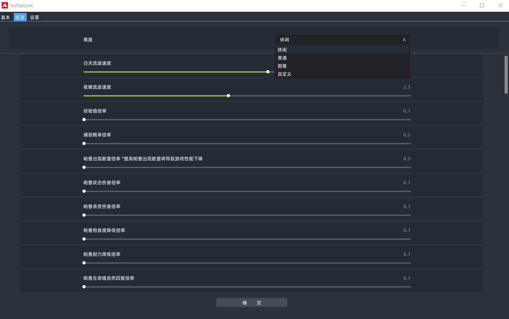

# Imgui PalWorld Game Manager Tool（简称 ImPalGmt）

一个基于imgui写的辣鸡管理工具，目前还在开发。

代码目前想到什么写什么，非常抽象。。。。。。。

# 特性

✔：已完成

💡：计划中

🟩：进行中

| 功能                          | 进度 |
| ----------------------------- | ---- |
| RCON命令                      | ✔    |
| 服务器信息（运行、内存、cpu） | ✔    |
| 服务器配置设置                | ✔    |
| 定时重启服务器                | ✔    |
| 定时备份                      | ✔    |
| 存档（迁移、修复、管理）      | 🟩    |

# 一些注意

配置通过本地`./data/config.json`读取，里边的格式参见`global.h`。然后点击`确认`会自动在目录下生成配置文件（暂时不考虑自动加入到服务器，因为更换配置需要重启，我觉得多余）

# 效果

